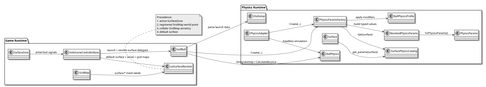
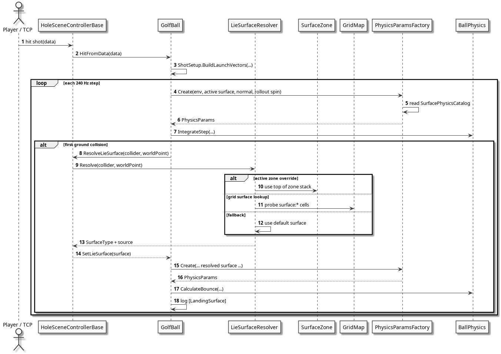

# OpenFairway Physics

Realistic golf ball physics engine for Godot 4.5+ C# projects. Usable from both C# and GDScript. The same runtime path powers the in-game `GolfBall` node and the headless `PhysicsAdapter`.

## Table of Contents
- [Requirements](#requirements)
- [Installation](#installation)
- [Quick Start (GDScript)](#quick-start-gdscript)
- [Runtime Architecture](#runtime-architecture)
- [Calibration Tooling Note](#calibration-tooling-note)
- [Regime Tuning Workflow](#regime-tuning-workflow)
- [Game Integration: Ball and Surface Ownership](#game-integration-ball-and-surface-ownership)
- [Surface Authoring](#surface-authoring)
- [API Reference - GDScript Usage](#api-reference---gdscript-usage)
  - [BallPhysics](#ballphysics)
  - [PhysicsParams](#physicsparams)
  - [BounceResult](#bounceresult)
  - [BounceCalculator](#bouncecalculator)
  - [Aerodynamics](#aerodynamics)
  - [Surface](#surface)
  - [PhysicsEnums](#physicsenums)
  - [ShotSetup](#shotsetup)
  - [PhysicsAdapter](#physicsadapter)
  - [PhysicsLogger](#physicslogger)
- [C# Runtime Helpers](#c-runtime-helpers)
- [Physics Flow](#physics-flow)
- [Bounce and Rollout](#bounce-and-rollout)
- [Surface Tuning](#surface-tuning)
- [Diagrams](#diagrams)
- [Units Convention](#units-convention)
- [References](#references)
- [License](#license)

## Requirements

- **Godot 4.5+** with **.NET support**
- **.NET 9.0 SDK** (or later)
- The addon is written in C#, but GDScript projects can consume it through Godot interop

### Installing .NET 9.0 SDK

**Windows**
1. Download the .NET 9.0 SDK from https://dotnet.microsoft.com/download/dotnet/9.0
2. Run the installer
3. Verify with `dotnet --version`

**Linux (Ubuntu/Debian)**
```bash
sudo apt update
sudo apt install dotnet-sdk-9.0
dotnet --version
```

**Linux (Fedora)**
```bash
sudo dnf install dotnet-sdk-9.0
dotnet --version
```

## Installation

1. Copy `addons/openfairway/` into your project's `addons/` directory.
2. Ensure your project has a C# solution. In Godot, use **Project > Tools > C# > Create C# Solution** if needed.
3. Build the project in Godot or run `dotnet build YourProject.csproj`.
4. Enable **OpenFairway Physics** in **Project Settings > Plugins**.

## Quick Start (GDScript)

```gdscript
var physics = BallPhysics.new()
var aero = Aerodynamics.new()
var surface = Surface.new()

var params = PhysicsParams.new()
params.air_density = aero.get_air_density(0.0, 75.0, PhysicsEnums.Units.IMPERIAL)
params.air_viscosity = aero.get_dynamic_viscosity(75.0, PhysicsEnums.Units.IMPERIAL)
params.drag_scale = 1.0
params.lift_scale = 1.0
params.surface_type = PhysicsEnums.SurfaceType.FAIRWAY
params.floor_normal = Vector3.UP

var fairway = surface.get_params(PhysicsEnums.SurfaceType.FAIRWAY)
params.kinetic_friction = fairway["u_k"]
params.rolling_friction = fairway["u_kr"]
params.grass_viscosity = fairway["nu_g"]
params.critical_angle = fairway["theta_c"]
params.spinback_response_scale = fairway["spinback_response_scale"]
params.spinback_theta_boost_max = fairway["spinback_theta_boost_max"]
params.spinback_spin_start_rpm = fairway["spinback_spin_start_rpm"]
params.spinback_spin_end_rpm = fairway["spinback_spin_end_rpm"]
params.spinback_speed_start_mps = fairway["spinback_speed_start_mps"]
params.spinback_speed_end_mps = fairway["spinback_speed_end_mps"]

var velocity = Vector3(40.0, 15.0, 0.0)
var omega = Vector3(0.0, 0.0, 300.0)

var force = physics.calculate_forces(velocity, omega, false, params)
print("Force: ", force)
```

## Runtime Architecture

- `BallPhysics` owns force, torque, integration, bounce math, and the shared flight-coefficient sampling path.
- `Aerodynamics` computes air density, viscosity, and exposes the shared drag/lift coefficient model.
- `PhysicsParamsFactory` is the canonical C# runtime path for combining environment, resolved surface, floor normal, rollout spin, and optional `BallPhysicsProfile`.
- `SurfacePhysicsCatalog` is the single source of truth for surface tuning.
- `Surface` is the GDScript-friendly wrapper over the same catalog values.
- `PhysicsAdapter` reuses the same parameter assembly path and the same flight-coefficient sampling path for headless regression runs.



Source: [`assets/diagrams/physics-runtime-components.puml`](assets/diagrams/physics-runtime-components.puml)

## Calibration Tooling Note

Carry calibration for source-of-truth comparison is handled by tooling in `tools/shot_calibration/`, including an optional bounded carry exception layer profile at `assets/data/calibration/carry_exception_profile.json`.

That layer is part of the calibration compare/analyze pipeline (`compare_csv.py` and `calibrate.py`) and is disabled by default unless explicitly enabled with `--carry-exceptions`. It does not change the addon runtime equations or in-game flight integration path in `addons/openfairway/physics/`.

For calibration commands and regime/window configuration details, see:

- `tools/shot_calibration/README.md`
- `assets/data/calibration/calibration_profile.json`
- `assets/data/calibration/carry_exception_profile.json`

## Regime Tuning Workflow

Use this workflow when the goal is to improve addon physics against FS reference data without launching gameplay scenes.

### What actually improves shots

Only two things move the measured carry numbers:

1. Changes to addon physics code under `addons/openfairway/physics/`
2. Changes to `BallPhysicsProfile` input, including `RegimeScaleOverrides` in `assets/data/calibration/calibration_profile.json`

`compare_csv.py` and `calibrate.py analyze` do not simulate shots. They only score the most recent headless physics export.

### RegimeScaleOverrides

`BallPhysicsProfile` now supports regime-keyed scale overrides:

```json
{
  "RegimeScaleOverrides": {
    "I-S1a-V3-P2": {
      "DragScaleMultiplier": 0.95,
      "LiftScaleMultiplier": 1.05
    },
    "D-S3-V1-P2": {
      "DragScaleMultiplier": 1.02,
      "LiftScaleMultiplier": 0.99
    }
  }
}
```

The regime key format is:

```text
<family>-<speed_bin>-<launch_bin>-<spin_bin>
```

Families:

- `C`: chip / very low speed (`speed < 60 mph`)
- `D`: driver-wood style (`speed > 110 mph` and `launch < 18 deg`)
- `W`: very high loft (`launch > 30 deg`)
- `I`: everything else, usually irons / wedges / approaches

Bins:

- Speed: `S0`, `S1a` (60-72 mph), `S1b` (72-85 mph), `S2`, `S3`, `S4`
- Launch: `V0`, `V1`, `V2`, `V3`, `V4`
- Spin: `P0`, `P1`, `P2`, `P3`, `P4`

Resolution order is most-specific to least-specific:

1. `I-S1a-V3-P2`
2. `I-S1a-V3`
3. `I-S1a`
4. `I`

Default regime overrides are baked into `BallPhysicsProfile.BuildDefaultRegimeOverrides()` (32 keys as of iteration 099). The `calibration_profile.json` is optional and only needed for experimental overrides during tuning.

Prefer specific regime keys (e.g. `D-S4-V1-P0`) over broad catch-alls (e.g. `D-S4-V1`) when sub-bins have opposite carry directions. Removing the `D-S4-V1` catch-all and replacing it with `D-S4-V1-P0`, `D-S4-V1-P1`, `D-S4-V1-P2` was necessary because P0 shots were short while P1/P2 were long.

### What to change first

For carry tuning:

- Shot is too short: decrease `DragScaleMultiplier`, increase `LiftScaleMultiplier`
- Shot is too long: increase `DragScaleMultiplier`, decrease `LiftScaleMultiplier`

Use small steps:

- Drag: `0.01`
- Lift: `0.005` to `0.01`

Do not start with global multipliers if the misses are clustered in short-shot bins. Use regime overrides first so short-shot tuning does not reopen driver and wood behavior.

### Target windows

Use these carry targets when reviewing reports:

- `<115 yd`: primary target `+-1 yd`, stretch target `+-0.5 yd`
- `115-150 yd`: `+-3 yd`
- `150-180 yd`: `+-7 yd`
- `>200 yd` drivers: keep within `+-15 yd`

If a regime has mixed signs, do not keep pushing it. Split the regime more narrowly or leave the remainder to the residual carry regime layer.

### Required iteration loop

1. Update source defaults in `BallPhysicsProfile.cs` (or optionally `assets/data/calibration/calibration_profile.json` for experimental overrides)
2. Re-export physics headlessly
3. Re-run analysis against the same FS reference corpus
4. Compare the new critical-carry report against the prior baseline

Example:

```bash
godot --headless --path . --script tools/shot_calibration/export_physics_csv.gd -- \
  '--profile=assets/data/calibration/calibration_profile.json' \
  '--dirs=res://assets/data|,res://assets/data/shot_session_2|s2,res://assets/data/shot_session_3|s3,res://assets/data/shot_session_4|s4' \
  '--output=assets/data/calibration/physics.csv'

python tools/shot_calibration/calibrate.py analyze \
  --show 129 \
  --critical-baseline assets/data/openfairway_critical_carry_20260314_0146.csv
```

### How to judge an iteration

Accept a regime change only if:

- Physics-only `% within +-3 yd` improves or stays stable
- `<115 yd` `% within +-1 yd` improves
- The critical baseline shows more improved shots than regressed shots
- Long-shot windows stay inside guardrails

Read the generated summary in this order:

1. `physics_only.within_3yd_pct`
2. `short_shot_priority.actual_within_1yd_pct`
3. `short_shot_priority.actual_within_0.5yd_pct`
4. `critical_baseline.improved` vs `critical_baseline.regressed`
5. `residual_regime_candidates`

### When to use the residual regime layer

The residual carry regime layer is for the remaining outliers after physics-only tuning captures the main shot families.

Use it only after the base physics path has already improved the broad regime. The runtime fallback should stay regime-based, not shot-name based.

## Game Integration: Ball and Surface Ownership

The runtime split is intentional:

- `GolfBall` owns launch state, collision handling, floor normal, active `SurfaceType`, and calls into `BallPhysics`.
- `HoleSceneControllerBase` wires the ball, applies the default surface from settings, registers `SurfaceZone`s and surface `GridMap`s, and supplies the `ResolveLieSurface` delegate.
- `LieSurfaceResolver` owns surface precedence. It resolves in this order: active zone override, registered `GridMap` world-point lookup, collider ancestry `GridMap`, then default surface.
- `PhysicsParamsFactory` and `SurfacePhysicsCatalog` decide how a surface changes bounce, spinback, and rollout. `GolfBall` should not branch on mesh names or surface-specific rules.

At log level `Info`, first impact prints a compact line like:

```text
[LandingSurface] surface=Green ... source=gridmap_world_point
```

That line is the quickest way to confirm the resolved lie surface and the bounce parameters used on landing.

## Surface Authoring

Use one of these two authoring paths:

1. **Base lie surface from `GridMap`**
   - Name `MeshLibrary` items with the plain surface names used by `res://assets/meshes/surface_types.tres`.
   - Supported item names: `Fairway`, `Green`, `Rough`.
   - `LieSurfaceResolver` reads those MeshLibrary item names at the ball's contact point.
2. **Local override from `SurfaceZone`**
   - Add `res://game/SurfaceZone.cs` to an `Area3D`.
   - Set its `SurfaceType`.
   - Use this for patches that should override the base `GridMap` result.

`PhysicsEnums.SurfaceType.FairwaySoft` and `PhysicsEnums.SurfaceType.Firm` remain available for settings and `SurfaceZone` overrides. They are not currently authored through `surface_types.tres`.

If you build a custom ball/controller flow, keep the same ownership boundary: resolve a `SurfaceType` outside the ball, then pass that surface into the physics parameter path.

## API Reference - GDScript Usage

Godot converts C# PascalCase members to GDScript snake_case. The classes below are available after building the project.

### BallPhysics

Core force, torque, and bounce calculations.

```gdscript
var physics = BallPhysics.new()
```

Useful exported constants:

| GDScript property | Value | Description |
|---|---:|---|
| `physics.ball_mass` | `0.04592623` kg | Regulation golf ball mass |
| `physics.ball_radius` | `0.021335` m | Regulation golf ball radius |
| `physics.ball_cross_section` | `pi * r^2` | Cross-sectional area |
| `physics.ball_moment_of_inertia` | `0.4 * m * r^2` | Moment of inertia |
| `physics.simulation_dt` | `1 / 120.0` s | Internal simulation timestep |
| `physics.spin_decay_tau` | `5.0` s | Air spin decay time constant |

```gdscript
var force: Vector3 = physics.calculate_forces(velocity, omega, on_ground, params)
var torque: Vector3 = physics.calculate_torques(velocity, omega, on_ground, params)
var bounce: BounceResult = physics.calculate_bounce(vel, omega, normal, state, params)
var cor: float = physics.get_coefficient_of_restitution(speed_normal)
```

### PhysicsParams

`PhysicsParams` is the runtime resource passed to `BallPhysics`.

```gdscript
var params = PhysicsParams.new()
params.air_density = 1.225
params.air_viscosity = 1.81e-05
params.drag_scale = 1.0
params.lift_scale = 1.0
params.kinetic_friction = 0.50
params.rolling_friction = 0.050
params.grass_viscosity = 0.0017
params.critical_angle = 0.29
params.surface_type = PhysicsEnums.SurfaceType.FAIRWAY
params.floor_normal = Vector3.UP
params.rollout_impact_spin = 0.0
params.spinback_response_scale = 0.78
params.spinback_theta_boost_max = 0.0
params.spinback_spin_start_rpm = 0.0
params.spinback_spin_end_rpm = 0.0
params.spinback_speed_start_mps = 0.0
params.spinback_speed_end_mps = 0.0
```

Key fields:

- `surface_type` tracks the resolved lie surface used for the step.
- `floor_normal` should be a unit vector at the ground contact point.
- `rollout_impact_spin` stores the spin captured at first landing.
- `initial_launch_angle_deg` carries the original VLA into the shared flight model for low-launch lift recovery and diagnostics.
- The `spinback_*` fields enable surface-weighted check and spinback behavior on steep, high-spin impacts.

### BounceResult

Returned by `calculate_bounce()`.

```gdscript
var result: BounceResult = physics.calculate_bounce(vel, omega, normal, state, params)
var new_vel: Vector3 = result.new_velocity
var new_omega: Vector3 = result.new_omega
var new_state: PhysicsEnums.BallState = result.new_state
```

### BounceCalculator

Standalone bounce physics, extracted from `BallPhysics`. Useful when you need bounce resolution without the full force/torque API.

```gdscript
var bc = BounceCalculator.new()

var result: BounceResult = bc.calculate_bounce(vel, omega, normal, state, params)
var cor: float = bc.get_coefficient_of_restitution(speed_normal)
```

Profile-aware overloads accept a `BounceProfile` for tunable COR curves and retention parameters:

```gdscript
var bp = BounceProfile.new()
var result: BounceResult = bc.calculate_bounce(vel, omega, normal, state, params, bp)
var cor: float = bc.get_coefficient_of_restitution(speed_normal, bp)
```

### Aerodynamics

Air density, viscosity, and drag/lift helpers.

```gdscript
var aero = Aerodynamics.new()

var density: float = aero.get_air_density(altitude, temp, PhysicsEnums.Units.IMPERIAL)
var viscosity: float = aero.get_dynamic_viscosity(temp, PhysicsEnums.Units.IMPERIAL)
var cd: float = aero.get_cd(reynolds_number)
var cl: float = aero.get_cl(reynolds_number, spin_ratio)
print(aero.cl_max)
```

### Surface

Compatibility helper for GDScript consumers. Internally it forwards to `SurfacePhysicsCatalog`.

```gdscript
var surface = Surface.new()
var p: Dictionary = surface.get_params(PhysicsEnums.SurfaceType.GREEN)
```

Returned dictionary keys:

- `u_k`
- `u_kr`
- `nu_g`
- `theta_c`
- `spinback_response_scale`
- `spinback_theta_boost_max`
- `spinback_spin_start_rpm`
- `spinback_spin_end_rpm`
- `spinback_speed_start_mps`
- `spinback_speed_end_mps`

Available surface types:

| GDScript enum | Description |
|---|---|
| `PhysicsEnums.SurfaceType.FAIRWAY` | Standard fairway baseline |
| `PhysicsEnums.SurfaceType.FAIRWAY_SOFT` | Softer fairway with more check and less rollout |
| `PhysicsEnums.SurfaceType.ROUGH` | Higher friction and drag |
| `PhysicsEnums.SurfaceType.FIRM` | Lower friction and more forward release |
| `PhysicsEnums.SurfaceType.GREEN` | Strongest spinback/check response |

### PhysicsEnums

The addon ships `physics_enums.gd` so enums are always available in GDScript.

```gdscript
PhysicsEnums.BallState.REST
PhysicsEnums.BallState.FLIGHT
PhysicsEnums.BallState.ROLLOUT

PhysicsEnums.Units.METRIC
PhysicsEnums.Units.IMPERIAL

PhysicsEnums.SurfaceType.FAIRWAY
PhysicsEnums.SurfaceType.FAIRWAY_SOFT
PhysicsEnums.SurfaceType.ROUGH
PhysicsEnums.SurfaceType.FIRM
PhysicsEnums.SurfaceType.GREEN
```

### ShotSetup

Shared launch parsing and vector building utilities.

```gdscript
var setup = ShotSetup.new()

var spin: Dictionary = setup.parse_spin({
    "BackSpin": 6399.0,
    "SideSpin": 793.0
})

var launch: Dictionary = setup.build_launch_vectors(
    150.0,
    12.5,
    -2.0,
    2800.0,
    5.0
)
```

`ShotSetup.parse_spin()` prefers measured `BackSpin` / `SideSpin` when present and only falls back to `TotalSpin` / `SpinAxis` when component spin is missing.

### PhysicsAdapter

Headless simulation helper. It uses the same `BallPhysics` + `PhysicsParamsFactory` path as the runtime ball.

```gdscript
var adapter = PhysicsAdapter.new()

var result_default: Dictionary = adapter.simulate_shot_from_json(shot_dict)
var result_green: Dictionary = adapter.simulate_shot_from_json(
    shot_dict,
    PhysicsEnums.SurfaceType.Green,
    Vector3.UP
)
```

Carry-only variants run the flight loop only (no bounce or rollout), useful for rapid calibration:

```gdscript
var carry_result: Dictionary = adapter.simulate_carry_only_from_json(shot_dict)
var carry_profile: Dictionary = adapter.simulate_carry_only_with_profile(shot_dict, profile)
var carry_flight: Dictionary = adapter.simulate_carry_only(shot_dict, flight_profile)
```

Returned keys include:

- `carry_yd`
- `total_yd`
- `apex_ft`
- `hang_time_s`
- `initial_spin_ratio`
- `initial_re`
- `initial_launch_angle_deg`
- `initial_low_launch_lift_scale`
- `initial_spin_drag_multiplier`
- `initial_backspin_rpm`
- `initial_sidespin_rpm`
- `initial_cd`
- `initial_cl`
- `peak_cl`
- `surface`
- `first_impact_spinback`
- `first_impact_tangent_in_mps`
- `first_impact_tangent_out_mps`

### PhysicsLogger

Controls physics console output for both runtime and headless paths.

| Value | C# name | GDScript int | Output |
|---|---|---:|---|
| `0` | `Off` | `0` | No output |
| `1` | `Error` | `1` | Errors only |
| `2` | `Info` | `2` | Launch summaries, first impact, `[LandingSurface]` diagnostics |
| `3` | `Verbose` | `3` | Per-step bounce and rollout detail |

```gdscript
PhysicsLogger.set_level(2)
PhysicsLogger.set_level(3)
var current: int = PhysicsLogger.get_level()
```

## C# Runtime Helpers

These are the runtime helpers the game layer uses directly:

- `PhysicsParamsFactory` builds `ResolvedPhysicsParams` from environment, surface, floor normal, rollout spin, and optional ball profile.
- `ResolvedPhysicsParams` is a plain C# object you can inspect in tests before converting to `PhysicsParams`.
- `BallPhysicsProfile` is the seam for ball-specific modifiers. Defaults are neutral so behavior stays unchanged unless you opt in.

```csharp
var factory = new PhysicsParamsFactory();
ResolvedPhysicsParams resolved = factory.Create(
    airDensity,
    airViscosity,
    dragScale,
    liftScale,
    PhysicsEnums.SurfaceType.Green,
    Vector3.Up,
    rolloutImpactSpin: 5024.0f,
    ballProfile: new BallPhysicsProfile(),
    initialLaunchAngleDeg: 12.5f
);

PhysicsParams parameters = resolved.ToPhysicsParams();
```

## Physics Flow

The current flow is:

1. Parse launch monitor data with `ShotSetup`, preferring measured `BackSpin` / `SideSpin`.
2. Resolve environment with `Aerodynamics`.
3. Resolve lie surface outside the ball.
4. Build runtime parameters through `PhysicsParamsFactory`.
5. Sample shared flight coefficients (`spin ratio`, `Re`, drag multiplier, lift recovery, `Cd`, `Cl`).
6. Integrate forces and torques in `BallPhysics`.
7. On first impact, use the resolved surface to drive bounce, check, spinback, and rollout.

Carry-sensitive flight behavior in that shared path is:

- Reynolds-aware drag coefficient with low-Re smoothing for dimpled-ball flight.
- Spin-ratio lift coefficient with a reduced-gain mid-spin high-Re band.
- Transitional-Re high-spin drag relief for wedge carry.
- Ultra-high-spin drag rebound for checked/flop trajectories.
- Low-launch lift recovery for wood/topped-style low-VLA shots.

Core calculations:

- Gravity: `g = (0, -9.81 * mass, 0)`
- Drag: `Fd = -0.5 * Cd * rho * A * v * |v|`
- Magnus: `Fm = 0.5 * Cl * rho * A * (omega x v) * |v| / |omega|`
- Grass drag: `Fgrass = -6 * pi * R * nu_g * v`
- Contact velocity: `v_contact = v + omega x (-n * R)`

`BallPhysics` uses `PhysicsParams.FloorNormal` for ground calculations, so slope-sensitive ground response and surface-sensitive rollout share the same parameter object.

`PhysicsAdapter` reads the same coefficient path for `initial_cd`, `initial_cl`, `peak_cl`, `initial_spin_drag_multiplier`, and the related carry diagnostics, so runtime and headless analysis stay aligned.

## Bounce and Rollout

`BallPhysics.CalculateBounce()` decomposes the impact into normal and tangential components, then applies retention, COR, and spin updates.

- Low-energy impacts keep the simple tangential retention path.
- Steep, high-energy impacts can enter the Penner-style tangential reversal branch.
- `CriticalAngle` controls when a surface crosses from shallow to steep behavior.
- `SpinbackResponseScale` weights the reverse tangential term by surface.
- `SpinbackThetaBoostMax` adds extra steep-impact help when the surface, spin window, and speed window allow it.
- `RolloutImpactSpin` carries the first-landing spin into the rollout friction model.

Green behavior is no longer hard-coded in `GolfBall`. If a green reacts differently, it is because the resolved `SurfaceType` maps to different physics parameters.



Source: [`assets/diagrams/landing-surface-sequence.puml`](assets/diagrams/landing-surface-sequence.puml)

## Surface Tuning

`SurfacePhysicsCatalog` is the single source of truth for the built-in surfaces:

| Surface | `u_k` | `u_kr` | `nu_g` | `theta_c` rad | `spin_scale` | `theta_boost` rad |
|---|---:|---:|---:|---:|---:|---:|
| Fairway | 0.50 | 0.050 | 0.0017 | 0.29 | 0.78 | 0.00 |
| FairwaySoft | 0.56 | 0.070 | 0.0024 | 0.32 | 0.92 | 0.00 |
| Rough | 0.62 | 0.095 | 0.0032 | 0.35 | 0.70 | 0.00 |
| Firm | 0.30 | 0.030 | 0.0010 | 0.25 | 0.60 | 0.00 |
| Green | 0.58 | 0.028 | 0.0009 | 0.36 | 1.12 | 0.12 |

Green also enables a spinback ramp:

- `spinback_spin_start_rpm = 3500`
- `spinback_spin_end_rpm = 5500`
- `spinback_speed_start_mps = 8`
- `spinback_speed_end_mps = 20`

Tune these files when behavior changes:

- `addons/openfairway/physics/SurfacePhysicsCatalog.cs` for per-surface values
- `addons/openfairway/physics/BallPhysics.cs` for shared formulas and physical constants
- `addons/openfairway/physics/BallPhysicsProfile.cs` for ball-specific modifiers

## GDScript Interop: Drift Risks and Migration Notes

### Enum naming convention

C# enums use PascalCase (`SurfaceType.Fairway`); GDScript mirrors in `physics_enums.gd` use UPPER_SNAKE_CASE (`SurfaceType.FAIRWAY`). The integer values match, but names differ:

| C# (`PhysicsEnums.cs`) | GDScript (`physics_enums.gd`) |
|---|---|
| `BallState.Rest` | `BallState.REST` |
| `BallState.Flight` | `BallState.FLIGHT` |
| `BallState.Rollout` | `BallState.ROLLOUT` |
| `Units.Metric` | `Units.METRIC` |
| `Units.Imperial` | `Units.IMPERIAL` |
| `SurfaceType.Fairway` | `SurfaceType.FAIRWAY` |
| `SurfaceType.FairwaySoft` | `SurfaceType.FAIRWAY_SOFT` |
| `SurfaceType.Rough` | `SurfaceType.ROUGH` |
| `SurfaceType.Firm` | `SurfaceType.FIRM` |
| `SurfaceType.Green` | `SurfaceType.GREEN` |

When adding new enum values to `PhysicsEnums.cs`, update `physics_enums.gd` to match. Integer values must stay aligned across both files.

### `.tres` file compatibility

`PhysicsParams` extends `Resource` and can be saved as `.tres`. Property renames or removals in C# will silently break saved `.tres` files — Godot loads them without error but the renamed properties revert to defaults. After renaming or removing a `PhysicsParams` property, re-export any `.tres` files that reference it.

### New API additions (iter 099)

- `BounceCalculator` — standalone bounce resolution with profile-aware overloads (see [BounceCalculator](#bouncecalculator))
- `SimulateCarryOnlyFromJson`, `SimulateCarryOnlyWithProfile`, `SimulateCarryOnly` — flight-only simulation variants on `PhysicsAdapter` (see [PhysicsAdapter](#physicsadapter))

### Surface type additions

`Green` was added after the initial release. GDScript consumers should include a default/fallback branch when switching on `SurfaceType`. `SurfacePhysicsCatalog.Get()` falls back to Fairway for any unrecognized surface type.

## Diagrams

- [`assets/images/physics-runtime-components.png`](assets/images/physics-runtime-components.png)
- [`assets/images/landing-surface-sequence.png`](assets/images/landing-surface-sequence.png)
- [`assets/diagrams/physics-runtime-components.puml`](assets/diagrams/physics-runtime-components.puml)
- [`assets/diagrams/landing-surface-sequence.puml`](assets/diagrams/landing-surface-sequence.puml)

Render with:

```bash
cd addons/openfairway/assets/diagrams
java -Djava.awt.headless=true -jar /usr/share/plantuml/plantuml.jar -tpng -o ../images physics-runtime-components.puml landing-surface-sequence.puml
```

## Units Convention

| Context | Units |
|---|---|
| Physics engine | SI: meters, m/s, rad/s |
| JSON or TCP input | Imperial: mph, degrees, RPM |
| Display conversion | Consumer responsibility |

Conversion constants:

- `1 mph = 0.44704 m/s`
- `1 RPM = 0.10472 rad/s`
- `1 meter = 1.09361 yards`

## References

### Primary Sources

1. **A.R. Penner** - "The Physics of Golf"  
   https://raypenner.com/golf-physics.pdf
2. **P.W. Bearman and J.K. Harvey** - golf ball aerodynamics data
3. **NASA Glenn Research Center** - Sutherland's Law  
   https://www.grc.nasa.gov/www/BGH/viscosity.html
4. **Barometric Formula** reference  
   https://en.wikipedia.org/wiki/Barometric_formula

### Calibration References

5. Launch monitor, range, and simulator comparison runs used for tuning carry, apex, bounce, and rollout.

## License

MIT - see [LICENSE](LICENSE).
